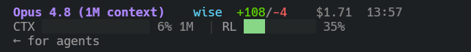

# claude-statusline

> 給 [Claude Code](https://claude.com/claude-code) 加上一條雙行狀態列，一眼掌握模型、git 狀態、花費與 context 用量。



## 顯示內容

| 行 | 欄位 |
|----|------|
| 第一行 | 模型 · git branch（`*N` = 未提交檔案數）· 目前資料夾 · 本次 `+新增/-刪除` 行數 · 累計花費 · 耗時 |
| 第二行 | `CTX` context 使用量進度條（綠/黃/紅）· `RL` 五小時 rate limit 進度條 |

進度條依使用率變色（60% 轉黃、80% 轉紅）。

## 安裝

```bash
git clone https://github.com/hhh1715/claude-statusline.git
cd claude-statusline
bash install.sh
```

重開一個 Claude Code session 即生效。

`install.sh` 只做兩件事，不覆蓋你其他設定：

1. 複製 `statusline-command.py` 到 `~/.claude/`
2. 將 `statusLine` 設定 merge 進 `~/.claude/settings.json`

## 需求

- `python3`（macOS 若未安裝：`xcode-select --install` 或 `brew install python`）
- 支援 256 色的終端機（macOS Terminal、iTerm2 皆可）

## 移除

刪除 `~/.claude/settings.json` 中的 `statusLine` 區塊即可。

<details>
<summary>手動安裝（不執行腳本）</summary>

1. 將 `statusline-command.py` 放到 `~/.claude/statusline-command.py`
2. 在 `~/.claude/settings.json` 加入以下設定（若檔案已有內容，只新增 `statusLine` 鍵，勿覆蓋整份）：

```json
{
  "statusLine": {
    "type": "command",
    "command": "python3 $HOME/.claude/statusline-command.py"
  }
}
```

</details>
